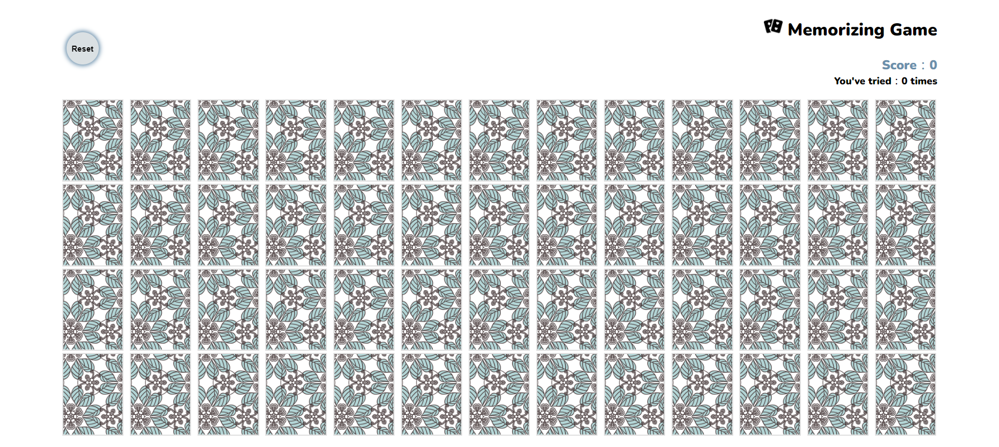

# CardsMemoryGame

**github page:**
https://wuwachon.github.io/CardsMemoryGame/

## game role

- choose and click any two of cards
- if cards points paired, get score of the pair until all cards paired!

## skills and practice

- basic html、css、javascript
- practice MVC(Model、View、Control) concept
